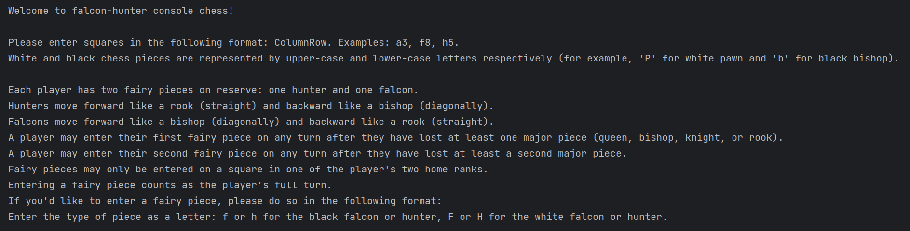
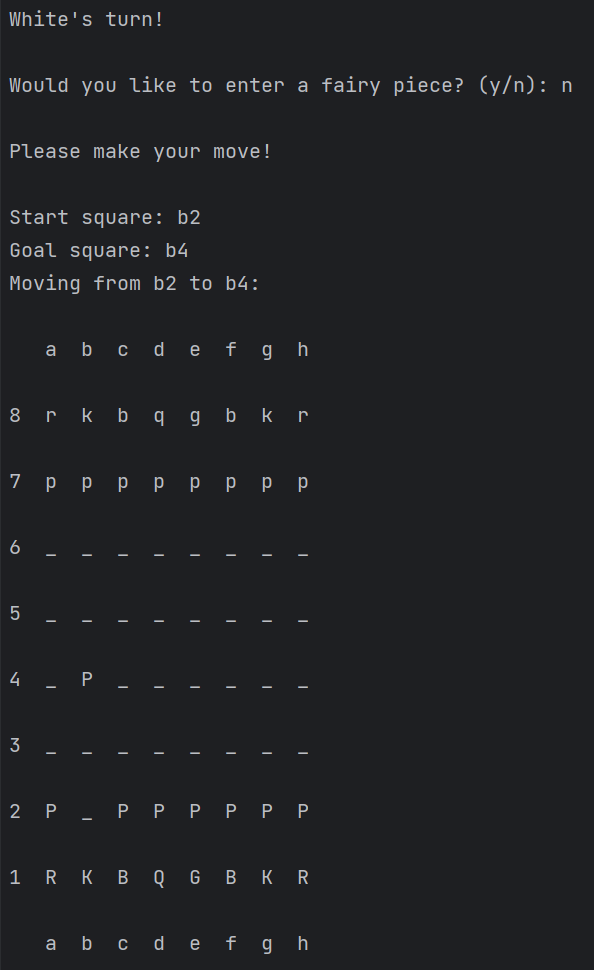
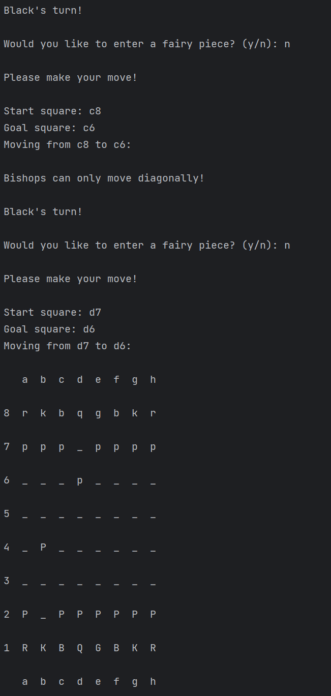

# Falcon - Hunter Console Chess

## Table of Contents

- [Description](#description)
- [Installation](#installation)
- [Usage](#usage)
- [Featured Design Principles](#featured-design-principles)
- [License](#license)
- [Roadmap](#roadmap)

## Description

In this text-based Falcon-Hunter Console Chess game, two players take turns to make moves on a chess board in a race to 
capture the opponent's king. The game is played entirely in the terminal. After each move, feedback and an updated view 
of the chess board are printed to the console.

### Demo:





## Installation

Note: This project was written and tested in Python 3.11. Although it may run in earlier versions of Python, I recommend 
using Python 3.11 or newer.

1. Clone the repository to your local machine:
    ```shell
    git clone https://github.com/evacgriffin/chess.git
   ```
2. Navigate into the project directory:
   ```shell
   cd chess
   ```
3. Install other required dependencies:
   ```shell
   pip install -r requirements.txt
   ```
4. Run the game:
   ```shell
   python main.py
   ```

## Usage

After launching the game, a quick introduction will walk you through how to play the game. The two players take turns.

Each turn contains the following steps in order:

- Display the chess board
- Display which player's turn it is
- Ask the player if they'd like to enter a fairy piece
- Prompt player to make their move
   * Prompt player to enter start square
   * Prompt player to enter goal square
- Print feedback
   * Prints reason why a move was illegal and could not be completed
   * Re-prompts current player for new input after an illegal move was attempted
   * If move was legal, confirm move
   * Prints if any pieces were captured

Players enter simple text commands. Yes-no questions are answered with 'y' or 'n'. Players specify which fairy piece
type they'd like to enter by typing 'f' for falcon or 'h' for hunter.
Squares on the board are specified by typing the column (a-f) followed by the row (1-8). For example, 'a3'
of 'f7'.

## Featured Design Principles

- Object-oriented design
- Separation of concerns
- Unit testing
- Type hinting
- Detailed doc strings and comments

## License

This project is licensed under the MIT License. See the [LICENSE](LICENSE) file for details.

## Roadmap

- [ ] Design and implement GUI
- [ ] Port to be playable online
- [ ] Add different game modes
- [ ] Add additional special chess pieces